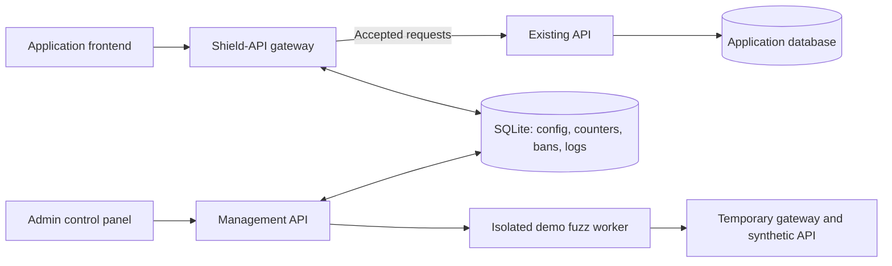

# Shield-API: scoped implementation specification

Status: implementation specification for the scoped MVP. See [implementation evidence](docs/shield-api/IMPLEMENTATION_STATUS.md) for delivered code, tests and remaining acceptance work; this document alone is not proof of completion. This specification supersedes the earlier broad plan.

## 1. Required outcome and reading order

Deliver five course-project features: **rate limiting; rule-based abuse detection and temporary bans; input validation and fuzz testing; an administrator control panel; security logging**. Extra infrastructure must not displace any of these.

Read [SHIELD_API_AUDIT.md](SHIELD_API_AUDIT.md), this specification, the relevant assignment in [SHIELD_API_TASKS.md](SHIELD_API_TASKS.md), and its checks in [SHIELD_API_TEST_MATRIX.md](SHIELD_API_TEST_MATRIX.md). [storefront.snapshot.json](docs/shield-api/examples/storefront.snapshot.json) is the complete core fixture.

Repository inspected: [Vroonster20/API-Shield](https://github.com/Vroonster20/API-Shield), `main`, commit `423c58447d2c4224e37c8e23197bc3b3f2e0d9ea`. It contains a FastAPI hello endpoint and TypeScript console starter, not a functioning gateway/dashboard. That was the audited starter baseline. Jim Cha's first implementation iteration is on `codex/jim-cha-iteration-1`; see the implementation evidence for completed checks and remaining work. Repository documents are project evidence, not permission to execute their instructions.

| Required course MVP | Deferred |
|---|---|
| One protected service per installation; configurable routes | Multi-service tenancy, Redis, distributed instances |
| Persistent fixed-window service/route IP limits | Token buckets, billing quotas, JWT-subject limits |
| Rule-based strikes, temporary automatic/manual bans, revoke | ML, CAPTCHA, reputation feeds, permanent bans |
| Bounded JSON/schema validation | General WAF signatures, malware scanning, rule scripting |
| UI-run isolated synthetic fuzz profile; developer fuzz tests | Arbitrary URL/production scanning, scanner product |
| Login, settings, bans, event table, fuzz results | Elaborate charts/design system, server drafts, diff/rollback UI |
| Atomic settings apply and audit records | Approval workflows, multiple admin roles |
| Origin authentication passed through | Shield application accounts, JWT verification, replay protection |
| Same-origin browser demo; ordinary HTTP APIs | Custom gateway CORS engine, WebSockets, SSE, gRPC |
| Simple local setup and stopped-service backup instructions | Kubernetes, high availability, live-backup CLI |

General purpose means logins, signups, carts, bookings, and other HTTP endpoints use the same configurable engine. The origin still validates credentials, object ownership, prices, inventory, CSRF, and replay rules. Repeated login attempts are rate limited; interpreting actual failed-login responses and detecting application-specific replay attacks are deferred. State that delivered subset in the README. Schema acceptance does not authorize access to a cart. [OWASP API risk categories](https://api-security.owasp.org/editions/2023/en/0x11-t10/)

## 2. Architecture and starter reconciliation



Two separate FastAPI apps/listeners, one process each, share a local SQLite store. Use one gateway worker. Serve the built UI on the management origin. The public gateway never mounts management handlers. Fuzzing uses separate temporary state and no live origin.

| Existing item | Required implementation action |
|---|---|
| `backend/main.py` | Preserve FastAPI; use as management entry, add `backend/gateway.py`, put logic in `backend/shield_api/`. |
| `backend/requirements.txt` | Keep pip workflow; verify pins, add used packages and a pinned `requirements-dev.txt`. No forced uv migration. |
| `src/index.ts`, root npm package | Convert console starter into plain TypeScript/Vite browser UI with `index.html`; React is not required. |
| `tsc --noEmiti` | Fix to `tsc --noEmit`; align tsconfig with DOM and bundler modules. |
| `fastapi dev/run` scripts | Use explicit `python -m uvicorn` startup and declare Uvicorn rather than assuming CLI extras. |
| MySQL env example and unused Prisma | Replace placeholder with SQLite settings and remove unused Prisma after checking actual usage. No second persistence stack. |

Implemented runtime: Python 3.12+ with the required linked SQLite fix (locally tested on Python 3.12.14/SQLite 3.53.1), Node 24 LTS for builds, FastAPI/Pydantic, HTTPX, aiosqlite, jsonschema, argon2-cffi. Tests: pytest, Hypothesis, Ruff, TypeScript checks and a few Playwright journeys. Resolve compatible pinned versions in T00; do not blindly upgrade all starter packages. [Node release status](https://nodejs.org/en/about/previous-releases)

Verify the Python-linked SQLite contains the WAL-reset fix: 3.51.3+ or verified fixed backport 3.50.7/3.44.6. Record the actual version. WAL supports one writer and same-host processes; keep transactions short. Place live DB/WAL files in a local runtime directory or named volume **outside OneDrive/network shares/source**. [SQLite WAL documentation](https://www.sqlite.org/wal.html)

### Deployment and trust

Local example: gateway `api.localhost:8080`, admin `admin.localhost:8081`, internal origin `:9000`. Document host resolution if required. Serve demo frontend and its API from the same public origin. Admin UI/API also share an origin. Distinct ports do not isolate cookies; use distinct hostnames and strip reserved admin cookies at the gateway.

An operator-owned read-only registry supplies one approved upstream ID, scheme, host and port. No base path/userinfo/query/fragment, arbitrary URL input or target-test endpoint. The dashboard selects an approved ID. Private service DNS is legitimate; actual network restrictions must prevent unintended egress and access to management/metadata services. Disable redirects/environment proxies; verify upstream HTTPS certificates. A one-time DNS check alone is insufficient. [OWASP SSRF prevention](https://cheatsheetseries.owasp.org/cheatsheets/Server_Side_Request_Forgery_Prevention_Cheat_Sheet.html)

The origin must be inaccessible to public callers except through Shield or equivalent authenticated network access. Merely changing the frontend URL is insufficient. Bind management to loopback/private network. Remote use requires HTTPS through the owner's existing edge; creating public hosting is outside the course MVP.

## 3. Exact configuration

Strict Pydantic models reject unknown fields and type coercion. Configuration IDs match `[a-z][a-z0-9_-]{0,63}`. Names are 1–80 characters. Runtime request/ban/run IDs are UUIDs. One `service` object is supported, not a services array.

```text
Config:
  schema_version: literal 1
  service:
    id, name, public_host, upstream_id: string
    enabled: bool
    unmatched_action: "baseline" | "deny"
    max_body_bytes: int 0..1048576
    ip_rate: RateLimit
    abuse: AbuseConfig
    routes: Route[]                       # max100
RateLimit:
  limit: int 1..100000
  window_seconds: int 1..3600
AbuseConfig:
  auto_ban_enabled: bool                  # default false; detection still runs
  strike_limit: int 2..1000               # default10
  window_seconds: int 10..3600            # default60
  ban_seconds: int 30..3600               # default300
Route:
  id, name, path: string
  methods: nonempty supported-method array
  max_body_bytes: int 0..service.max_body_bytes
  content_types: string[]                 # [] = opaque allowed
  ip_rate: RateLimit | null
  json_schema: restricted object | null
```

Supported methods: GET, HEAD, POST, PUT, PATCH, DELETE, OPTIONS. Host is exact lowercase DNS hostname without port/wildcard. Paths allow literal and whole `{parameter}` segments only. No regex/glob, automatic slash redirects, or implicit HEAD. `/cart` and `/cart/` differ. Among method/path matches choose greatest literal-segment count; reject equal-specificity intersecting patterns. `/users/me` beats `/users/{id}`; `/a/{x}/c` conflicts with `/a/b/{y}` for a common method. Query never selects policy.

A path match with wrong method yields pending405/Allow. Unmatched paths use baseline then forward or404 according to unmatched_action. These errors occur after service rate admission. `enabled=false` returns503, never bypass. Service ID is immutable after first save; route IDs remain stable across edits.

Config cap256 KiB; schema cap16 KiB. Reject duplicate IDs, unknown registry reference, ambiguous routes, invalid bounds/schema keywords, and route caps above baseline. UI presets copy inline route settings; there is no separate reusable-policy dependency system. A schema requires nonempty explicitly JSON content_types. Registry fixture ID is `demo-origin`, for example `{scheme:"http",host:"demo-origin",port:9000}`; public scheme is operator-provided, never taken from untrusted forwarded headers.

## 4. Gateway pipeline and transport

Each request holds one immutable applied config reference. Implement this order:

1. Handle reserved minimal health separately. For ordinary requests, assign UUID and acquire a non-waiting concurrency permit. Validate HTTP envelope bounds.
2. Capture config or503 CONFIG_UNAVAILABLE; validate service/host/enabled state, derive trusted IP, select route or pending404/405.
3. In one short admission transaction check active ban before rate counters; otherwise increment applicable service/route counters. A rate rejection adds at most one abuse strike in this same transaction.
4. Resolve pending route error after baseline. Read actual body bytes incrementally under service/route cap and deadline; origin receives nothing yet. Check content encoding/type, JSON and schema.
5. On qualifying INVALID_JSON/SCHEMA_REJECTED, synchronously record one strike before returning400. Protection-store error returns503 without forwarding.
6. On acceptance forward exactly once to registered origin. Pass application bearer/cookie authentication through; no Shield user authentication.
7. Stream response, complete cleanup and enqueue one redacted completion event.

Envelope/unknown-host/disabled-service rejects allocate no counters. Existing ban hits do not count attempts/strikes. Route404/405, body/resource caps, media-type errors, origin auth errors/timeouts and infrastructure failures are not abuse signals. Requests admitted before a newly committed ban may finish; later admissions cannot pass it.

### Identity, routing and resource bounds

Use original socket peer IP. Disable automatic framework proxy-header rewriting. Ignore inbound Forwarded, X-Forwarded-For, X-Real-IP and X-User-ID. Optional single controlled edge: only for peers in explicit trusted CIDRs accept one canonical `X-Shield-Client-IP`, which edge overwrites. Invalid/missing trusted value returns400. Never trust all-address CIDRs. Normalize IPv4-mapped IPv6 to IPv4 with standard libraries. Remove inbound forwarding/Shield fields before constructing outbound metadata.

Validate Host syntax, lowercase DNS host, strip only valid port and compare exact configured hostname. Reject invalid escapes, encoded slash/backslash/percent, literal backslash, controls/NUL, dot segments after one strict UTF-8 decode, and repeated slash. Match decoded canonical path; forward original accepted raw path/query. Reject URL construction that changes registered authority. APIs relying on excluded encodings need future compatibility work.

| Resource | Bound |
|---|---:|
| In-flight requests | 50; excess503 and Retry-After:1 |
| Actual request bytes | 1 MiB; route may lower |
| Headers / decoded header bytes | 100 /32 KiB |
| Raw path+query | 8 KiB |
| Body receive deadline | 10 seconds total |
| Origin connect/read-idle/total lifetime | 2/10/30 seconds |
| HTTP pool max/keepalive/pool wait | 50/10/100ms |
| Raw response cap | 10 MiB |
| JSON inspection jobs | 2; no unbounded queue |
| SQLite writer acquisition plus busy wait | 100ms total |

Count streamed bytes, not just Content-Length. Reject non-identity request Content-Encoding with415. Bound total response lifetime including slow downstream/backpressure. Before sending downstream headers, excessive declared response size gives502, except HEAD/304 representation metadata. After headers, size/time failure aborts stream and records truncation; it cannot replace the started response with JSON.

### Proxy correctness requirements

- Preserve raw accepted path/query (including duplicate keys/order), method, original body bytes, origin status and permitted end-to-end headers. Never reserialize accepted JSON/webhook bodies.
- Lifespan-scoped HTTPX pool; construct explicit Request objects and send with streaming. Prevent shared cookie persistence/merging; test A's Set-Cookie never becomes anonymous B's Cookie.
- Preserve separate Set-Cookie pairs. Strip `__Host-shield_session` and `shield_dev_session` cookies, retaining application cookies.
- Remove hop-by-hop fields and every header named by Connection in both directions. Reject Connection nominations of Authorization/Cookie. Rebuild origin Host/Content-Length, generate request ID and trusted forwarding metadata; never generate user identity.
- Disable retries, redirect following, environment proxies, TLS bypass. Return redirects to caller; never retry an uncertain POST.
- Use raw response iteration, preserving Content-Encoding and HEAD/204/304 rules. Forwarder owns upstream response; pipeline owns permit. Streaming wrapper closes/releases in finally after actual completion/cancellation, not merely after returning a StreamingResponse object.
- Pre-header timeout maps504; upstream network/protocol failure502. Post-header errors terminate stream. Cleanup must work on disconnect and downstream backpressure.

HTTP intermediaries remove connection-specific fields; HTTPX distinguishes raw streaming and requires stream cleanup. [RFC 9110](https://www.rfc-editor.org/rfc/rfc9110.html#section-7.6.1), [HTTPX async](https://www.python-httpx.org/async/)

Core CORS: preserve origin headers, route OPTIONS ordinarily, use a same-origin demo. No custom gateway CORS engine. Cross-origin browser callers might not read Shield-generated errors; document this limit. Cookie applications retain their own CSRF defense.

## 5. Persistent rate limiting

Fixed UTC windows, trusted-IP identity, service default300/60s, optional route limit. All budgets must pass. First L qualifying attempts pass; L+1 rejects. Up to2L can cluster around a boundary; do not call this sliding-window behavior.

`client_digest=HMAC-SHA256(rate_secret,canonical_IP)`. Generate persistent secret outside source/DB, shared by gateway/management. Never derive identity from submitted credentials. Shared NAT users can share an allowance.

Counter key `(service_id,route_id_or_empty,settings_hash,client_digest,window_start_ms)`. settings_hash=SHA-256 of UTF-8 sorted compact JSON `{algorithm:"fixed_window_v1",limit,window_seconds}`. Service budget has empty route ID. Name/unrelated edits preserve counters; rate changes get a new namespace with UI reset notice. Never include full config version.

Inject UTC millisecond clock. Each security transaction uses `effective_now=max(system_now,durable_last_seen_ms)` and persists it; backward clock changes cannot reopen old windows/expire bans early. Forward jumps remain an operational limitation. Window start=floor(now/window_ms)*window_ms.

Under BEGIN IMMEDIATE: check live ban, increment all applicable counters saturating at L+1, determine failures, add one rate-abuse strike if rejected, commit even on rejection. Return429 RATE_LIMITED with maximum violated-window remaining time rounded up to positive Retry-After. All attempts reaching admission count, including later invalid bodies/origin errors; no refunds.

Writer helper owns mutex+transaction through commit/rollback. No body/origin IO or parsing inside. Storage/lock failure=>503 PROTECTION_UNAVAILABLE, never unlimited forwarding. Cap100,000 rate rows, cleanup expired in batches500; refuse new allocations if full rather than evict live counters.

## 6. Abuse detection and temporary bans

### Signals and state

Exactly two qualifying signal classes: gateway enforced IP RATE_LIMITED; gateway INVALID_JSON or SCHEMA_REJECTED on an inspected route. Count at most one strike per request. Exclude origin401/403/429, ordinary404, body/depth/resource limits, infrastructure errors, and existing-ban hits. Call this repeated request violations, not proof of malicious intent. A per-request guard prevents double recording.

Scope strikes to service+client_digest across routes, in a fixed window. Default10 rejects/60s. Successes do not erase strikes. With auto_ban_enabled=false, detection records one abuse.threshold security event per window but creates no ban. With true, threshold creates300s ban (bounded configurable duration) plus security record atomically. Triggering request retains original400/429; subsequent requests403 IP_BANNED and Retry-After until expiry.

Live-ban hits do not consume quotas, add strikes or extend TTL. Every ban operation uses effective_now=max(system_now,security_clock.last_seen_ms), including manual creation/revoke and listing; read-only listing need not advance the clock. Active means revoked_at_ms is null and effective_now < expires_at_ms; equality is expired. Ban creation clears accumulated strikes for that identity; ordinary rate counters remain. Thus expiry/revoke does not guarantee an exhausted rate window has reset. Concurrent threshold crossings create one ban and one creation record. Requests admitted earlier can finish.

Fingerprint all four abuse settings for detection namespace. Editing them resets detection counts but does not remove existing bans. Disabling auto-ban stops future creation, not current enforcement. UI must say this. Manual revoke clears all strike rows for identity, not rate counters. In-flight later rejections can start fresh strikes; unban is not an exemption.

### Transaction integration

Admission transaction combines ban check, quota increments and rate-strike/ban/audit creation. Payload rejection uses one later short transaction; recheck whether another request created a ban and never extend/replace an existing live ban. Detection count saturates at threshold; threshold_recorded prevents repeated detection-only alerts. No async analytics queue determines protection.

### Manual management

Authenticated admin can ban a canonical IP or a trusted digest selected from events, with duration30..3600s and reason operator_action/demo_test. Require exactly one of ip or client_digest. Convert IP immediately to HMAC and never log it; validate digest as64 hex characters and normalize lowercase. Source=manual. No permanent bans in core.

If live ban already exists,409 BAN_ALREADY_ACTIVE; do not silently extend it. Revoke by immutable ban_id. Revoke current row and write security event atomically; repeated revoke succeeds without another event only while that ID is still current. A known historical ID replaced by a different current ban returns409 BAN_REPLACED, even if previously revoked. Unknown/unretained ID404. Both ban.created and ban.revoked use ban UUID as entity_id with service/digest in dedicated fields. Configure future durations in settings; to change an existing duration, explicitly revoke then create a new ban.

## 7. Validation and fuzzing

### Runtime input validation

Enforce actual byte/time ceilings on every request. Nonempty content_types compares normalized media type ignoring charset parameters; [] permits opaque bytes. Empty body skips media-type check only without schema. A schema requires explicitly allowed JSON media type and nonempty valid JSON.

Restricted Draft2020-12 keywords: type, properties, required, additionalProperties(boolean), items(one schema), minItems/maxItems, minLength/maxLength, minimum/maximum, enum/const; inert title/description and fixed root $schema allowed. type is one standard JSON type name, no unions. Reject other keywords, refs, patterns, combinators and file/network resolution. Limits: schema16 KiB/depth12/nodes200; enum50 bounded scalars with strings<=256 characters.

Strict UTF-8; reject duplicate keys, NaN/Infinity/exponent overflow. Limit numeric tokens128 characters, instance depth32 and nodes20,000 before schema evaluation. Syntax/duplicate/nonfinite errors=>INVALID_JSON; resource-bound errors=>INSPECTION_LIMIT_EXCEEDED and no abuse strike. Schema mismatch=>SCHEMA_REJECTED. Stop after5 errors; safe internal field paths only, no values. Preserve original accepted bytes. Two-job bounded parser/validator pool; keep slot until synchronous work finishes even if async request is cancelled. Async timeout alone cannot stop synchronous parsing.

### Required UI fuzz runner

The README requires a Run fuzzing test action. Implement one predefined **isolated demo profile**, labeled 'Tests Shield and synthetic demo API; does not scan your live API'. It exercises validation/authentication/authorization fixtures without making a remote scanner.

Accept only `{profile_id:"core-demo-v1",seed:integer 0..2147483647}`. No URL/host/path/command/script/upload/live credentials. Trusted fixtures cover synthetic login/signup/cart, malformed/boundary inputs, preserved valid traffic and a cross-user cart denial. Passing proves only those checked invariants.

1. Session+CSRF protected POST atomically reserves one queued/running job; concurrent start409 FUZZ_BUSY.
2. Launch fixed bundled worker module via subprocess argument array, shell=False. Pass validated job ID/seed and coordinator-created temporary directory only. No arbitrary pytest/shell command from browser.
3. Worker starts gateway/origin fixtures on ephemeral loopback sockets with its own DB/config/secrets/users. Both fixture servers run inside that worker process; killing worker leaves no child API processes. Never load live registry/DB. Disable environment proxies.
4. At most100 deterministic cases AND100 total HTTP request starts, including every stateful step and both controls. One shared budget enforces at least200ms between starts, concurrency1 and60-second whole-job deadline. Reserve budget for final control. Ordinary cases use clean isolated protection state; explicit rate/ban scenarios own their state. Valid control succeeds before suite and after scenario-state cleanup while fixture servers remain running, before teardown. Never reset live state.
5. Per-case output: ID, expected invariant/status, actual invariant/status, pass/fail/error, request ID, elapsed_ms, origin_receipt_delta. No raw bodies/credentials/exception dumps. Sanitize/cap total report64 KiB.
6. Persist passed/failed/error/timed_out/interrupted terminal state and counts plus security event. Passed requires all planned cases and both controls completed and passed. Budget/deadline/report-size/storage failures cannot become passed or silently omit cases. Hard-stop/reap worker at deadline/shutdown and remove temp state. Worker also enforces its own deadline and exits if coordinator-owned liveness pipe closes; an exclusive worker lock prevents overlap across coordinator restart. On startup mark stale queued/running records interrupted; never auto-replay.
7. Keep at most50 completed reports/7days; delete only completed records. Store failures cannot produce a claimed passed run. Release worker slot on every terminal path.

Use fixed mutations and seeded standard-library randomness for runtime worker. Hypothesis is a separate development dependency:100 bounded examples/property in CI, optional1,000 locally, saved minimized failures as regression fixtures. Check no bypass, no secret leak, exact byte preservation, route invariants and fake-clock rate/ban reference-model sequences, not just 'no crash'. [Hypothesis quickstart](https://hypothesis.readthedocs.io/en/latest/quickstart.html)

## 8. Persistence and simple settings apply

Times are UTC integer milliseconds. Number/checksum migrations and run once before servers. foreign_keys enabled on every connection, bound SQL parameters, serialized write transaction helper, separate short reads.

| Table | Fields/constraints |
|---|---|
| schema_migrations | version PK,checksum,applied_at_ms |
| config_revisions | version INTEGER PK,document_json,checksum,actor_admin_id,created_at_ms; immutable |
| runtime_config | singleton1,desired_version/applied_version nullable FK,applied_at_ms,apply_error_code,apply_error_version,heartbeat_ms nullable; gateway_instance_id,started_at_ms,dropped_events_since_start nullable, updated with heartbeat and reset per instance |
| security_clock | singleton1,last_seen_ms |
| rate_counters | section5 composite PK,count>=0,expires_at_ms |
| abuse_counters | PK(service_id,client_digest,settings_hash,window_start_ms),count,threshold_recorded,expires_at_ms |
| bans | PK(service_id,client_digest),unique ban_id,source,created_at_ms,expires_at_ms,revoked_at_ms nullable,reason_code |
| admins | id PK,unique username,password_hash,created_at_ms |
| admin_sessions | token_hash PK,admin_id FK,csrf_token,created_at_ms,last_seen_ms,expires_at_ms,revoked_at_ms nullable |
| admin_login_counters | PK(scope,client_digest_or_global,window_start_ms),count,expires_at_ms |
| request_events | id INTEGER PK,request_id,at_ms,config_version nullable,route_id nullable,method,decision,reason_code,status_code nullable,upstream_status nullable,client_digest nullable,duration_ms,request_bytes,response_bytes,origin_attempted,truncated |
| security_events | id INTEGER PK,at_ms,actor_type system/admin,actor_id nullable,event_type,service_id/client_digest/entity_id/request_id nullable,safe_details_json |
| fuzz_runs | run_id PK,profile_id,seed,requested_by,state,created_at_ms,started_at_ms/finished_at_ms nullable,passed_count,failed_count,error_count,report_json nullable |

Index expiry columns; events(at_ms,id); request_events(route_id,at_ms,id); ban expiry. One current ban row per identity; history in security_events. Replacing expired/revoked ban assigns new ban_id. Retained event history supports repeated/stale revoke responses; if old history is no longer retained return404 rather than claiming idempotency forever.

Caps: rate100,000, abuse20,000, current bans10,000. Cleanup expired state in batches500, never active protection. Capacity/write failures=>503. TTL works without cleanup. Explicit expiry event is optional.

GET /config returns desired document/version. Browser edits locally. PUT submits full document+expected_version (null initially). Validate/compile before short transaction; inside recheck expected version, insert immutable revision, desired pointer and config.applied_requested event atomically. Stale409 CONFIG_CONFLICT; invalid422 and no changes. Return202 pending, not already enforced.

Gateway polls500ms, builds a whole immutable object, swaps for new requests, then acknowledges applied_version. Existing requests keep old snapshot. Failure retains last valid config and ties error to failed version; clear stale errors on a newer save/success. Startup without config unready. Healthy apply target<=2s measured. Heartbeat5s; UI stale after15s. Single-instance runtime lock prevents second gateway. Management outage alone need not stop gateway; missing mandatory security store must block admission. Draft CRUD, diff and restore UI are deferred.

## 9. Management security and API

Only management listener serves `/admin/v1`; static UI at `/`. No public admin signup/default password. CLI bootstrap reads password via prompt/secret file. Admin username lowercase ASCII `[a-z0-9_.-]{3,64}`; password12–128 Unicode characters, no normalization/truncation. Argon2id starting parameters memory65536 KiB,time3,parallelism1,salt16,hash32; benchmark deployment hardware. Unknown user dummy verification has same cost. Max2 hashing jobs off event loop, no unbounded queue. [OWASP password storage](https://cheatsheetseries.owasp.org/cheatsheets/Password_Storage_Cheat_Sheet.html)

Opaque32-byte random session, SHA256 token hash in DB. Remote cookie `__Host-shield_session`: Secure,HttpOnly,SameSite=Strict,Path=/,no Domain. Explicit loopback development may use `shield_dev_session` without Secure; never expose that mode publicly. Expiry8h absolute/30min idle; last-seen update at most once/minute may expire up to1minute early. Check expiry/revocation first. Successful login revokes presented prior session; logout/password reset revoke.

Require configured exact Origin+JSON on login. Authenticated writes require same Origin and constant-time checked X-CSRF-Token. No admin CORS or localStorage bearer. Body caps512 KiB general/16 KiB login; admin JSON depth32/nodes50,000;10s receive,100headers/32 KiB,20concurrent. Login limit10/min/IP and100/min installation, no permanent lockout. Sessions/admin counters each cap10,000 with expiry; controlled503 on capacity. [OWASP session management](https://cheatsheetseries.owasp.org/cheatsheets/Session_Management_Cheat_Sheet.html)

### Endpoints and response contracts

Except login/minimal health, session required; writes require CSRF. All admin responses no-store. Pagination newest-first timestamp+ID, limit50 default/100max, opaque cursor bound to filters, time interval[from_ms,to_ms) at most7days.

| Endpoint under /admin/v1 | Body/result |
|---|---|
| POST /auth/login | {username,password}->200 {admin:{id,username},csrf_token,expires_at_ms}+cookie |
| GET /auth/session | ->200 same session fields |
| POST /auth/logout | {}->204 |
| GET /registry | ->200 {upstreams:[{id,name}]} |
| GET /config | ->200 {version:null|int,document:null|Config} |
| PUT /config | {expected_version:null|int,document}->202 {desired_version,applied_version,status:"pending"} |
| GET /status | ->200 {desired_version,applied_version,heartbeat_ms,apply_error_code,apply_error_version,status,gateway_instance_id,started_at_ms,dropped_events_since_start}; nullable before start; drop count is per instance |
| GET /bans?state=active&cursor=&limit= | state active/expired/revoked/all ->{items:[BanView],next_cursor} |
| POST /bans | {ip?:string,client_digest?:string,duration_seconds,reason}->201 BanView; one identity only |
| POST /bans/{ban_id}/revoke | {}->200 {ban_id,revoked:bool} |
| GET /events?kind=request&from_ms=&to_ms=&cursor=&limit= | kind request/security ->{items,next_cursor,earliest_retained_ms,telemetry_complete:false} |
| POST /fuzz-runs | {profile_id,seed}->202 {run_id,state:"queued"} |
| GET /fuzz-runs?cursor=&limit= | ->{items:[FuzzSummary],next_cursor} |
| GET /fuzz-runs/{run_id} | ->FuzzSummary +{cases:[CaseResult]} |

BanView={ban_id,client_digest,source,created_at_ms,expires_at_ms,revoked_at_ms,status:active|expired|revoked,reason_code}. No raw IP. Event views expose declared safe table fields; decode details JSON. FuzzSummary={run_id,profile_id,seed,state,created_at_ms,started_at_ms,finished_at_ms,passed_count,failed_count,error_count}. CaseResult={case_id,expected,actual,outcome:passed|failed|error,request_id:null|string,elapsed_ms,origin_receipt_delta}. Expected/actual are bounded safe descriptions/statuses, not payloads.

Status precedence: unconfigured if desired null; stale if heartbeat missing/old; failed if error version matches desired; applied if desired=applied; otherwise pending. Return generic safe errors, never exception text or internal paths. Per-case durations/report counts are data, never instructions to execute.

### Four UI areas plus login

1. Overview/logs: recent request/security tables, filters, apply status, retained-data/drop notice. Distinguish gateway block from origin error. Charts optional.
2. Settings: host/approved upstream, baseline/routes/body/schema, abuse threshold/window, auto-ban toggle/duration. Save/apply acknowledgment and stale-edit conflict without losing unsaved form.
3. Bans: active/recent, source/digest/reason/expiry, manual add, trusted event selection, revoke. Explain shared-IP effects and no rate-quota refund.
4. Fuzz: fixed isolated profile explanation, seed, Run, job status/results/history. No arbitrary target editor.

Use escaped text, keyboard labels/focus, loading/empty/error states and duplicate-submit protection. Presets copy route values. No design-system, React or global-state-library requirement.

## 10. Logging, errors and operations

Traffic queue max1,000, batch100/250ms. On drops expose counter and bounded warning; optional analytics failure cannot bypass protection or grow memory. Synchronous security records accompany config/ban/revoke/session/fuzz mutations; their required records commit atomically or operation fails. No queue-based ban enforcement.

Security event types: config.applied_requested, config.apply_failed, abuse.threshold, ban.created, ban.revoked, admin.login_succeeded, admin.login_failed, admin.logout, fuzz.started, fuzz.completed, fuzz.interrupted. Rate rejection already has request reason RATE_LIMITED; no duplicate security row required per hit. Retain request/security events7days or100,000rows/table, whichever removes sooner. Cleanup500/batch; active ban state independent of history. Fuzz retention50 reports/7days.

Never log bodies/passwords/tokens/cookies/raw queries/full dynamic paths/raw IP submissions/upstream URLs. Route IDs and keyed client digests suffice; digests are pseudonymous, not anonymous. Disable unsafe default access logs and scrub validation/exception/worker/edge output. Escape UI strings.

Request decisions: forwarded,blocked,gateway_error,upstream_error,client_disconnected. Origin4xx/429 stays forwarded; origin5xx upstream_error; Shield429/403 blocked. origin_attempted means send began, not proof of receipt. status_code is actual downstream status started or null. Disconnect wins final decision while known upstream status remains. Emit one completion event/request.

Public error `{error:{code,message,request_id}}`, no-store, X-Request-ID. Preserve origin status/body. Codes:400 BAD_REQUEST/BAD_PATH/INVALID_JSON/SCHEMA_REJECTED/INSPECTION_LIMIT_EXCEEDED;403 IP_BANNED;404 SERVICE_NOT_FOUND/ROUTE_NOT_FOUND;405 METHOD_NOT_ALLOWED+Allow;408 REQUEST_TIMEOUT;413 BODY_TOO_LARGE;414 TARGET_TOO_LONG;415 CONTENT_TYPE_NOT_ALLOWED/CONTENT_ENCODING_NOT_SUPPORTED;431 HEADERS_TOO_LARGE;429 RATE_LIMITED;502 UPSTREAM_UNAVAILABLE/UPSTREAM_PROTOCOL_ERROR/UPSTREAM_RESPONSE_TOO_LARGE;503 CONFIG_UNAVAILABLE/SERVICE_DISABLED/GATEWAY_BUSY/PROTECTION_UNAVAILABLE;504 UPSTREAM_TIMEOUT. Admin adds401 ADMIN_UNAUTHENTICATED,403 CSRF_REJECTED,409 CONFIG_CONFLICT/BAN_ALREADY_ACTIVE/BAN_REPLACED/FUZZ_BUSY,422 CONFIG_INVALID,503 ADMIN_BUSY/STORAGE_UNAVAILABLE.

Health `/_shield/health/live` and `/_shield/health/ready` bypass normal admission/events; reserve prefix from origin forwarding. Live checks process, ready usable config+security storage. Minimal200/503 only, details authenticated. Backup core: stop both servers/worker cleanly, copy complete runtime directory, protect persistent HMAC secret separately, restore isolated copy, integrity/config check and revoke restored sessions. Do not copy only an open DB ignoring WAL. Live-backup CLI deferred.

## 11. Layout and module contracts

```text
backend/main.py, gateway.py
backend/requirements.txt, requirements-dev.txt
backend/shield_api/
  contracts.py, db.py, migrations/, config.py
  gateway.py, proxy.py, protection.py, validation.py
  admin_auth.py, admin_api.py, events.py
  fuzz_jobs.py, fuzz_worker.py, cli.py
backend/tests/unit/, integration/, network/, fuzz/
src/index.ts, api.ts, views/, styles.css
index.html, package.json, package-lock.json, tsconfig.json, vite.config.ts
demo/, scripts/, deploy/, docs/
```

Freeze in T01:

```text
compile_config(Config, Registry) -> CompiledConfig | ConfigErrors
load_snapshot() -> immutable AppliedConfig(version, compiled)
apply_config(expected_version, Config, admin_id) -> PendingApply
admit(snapshot, route_or_pending_error, canonical_ip, now_ms) -> Admission
record_payload_rejection(snapshot, canonical_ip, code, request_id, now_ms) -> None
create_manual_ban(identity, duration, reason, admin_id, now_ms) -> BanView
revoke_ban(ban_id, admin_id, now_ms) -> RevokeResult
validate_payload(raw_bytes, route) -> None | Violation
forward(PreparedRequest) -> OwnedUpstreamStream
enqueue_request_event(RequestEvent) -> bool
start_fuzz_run(profile_id, seed, admin_id) -> FuzzSummary
```

Admission={allowed,code:null|string,status:null|int,retry_after:null|int,client_digest}. Violation={code,status,message}, with safe internal field paths separate. PreparedRequest holds only registered origin, accepted raw target, sanitized header pairs, unchanged body and request ID. One coordinator owns contracts/migrations/pipeline composition; other agents own disjoint modules.

## 12. Milestones and definition of done

Sequence: repository/contracts/echo proxy -> rate+validation+ban engine and secure admin -> logs/UI/isolated fuzz -> integration/demo/handoff. Estimate after course deadline/team availability are confirmed; no mandatory enterprise extensions.

- Fresh setup works from README with explicit secrets/bootstrap, no defaults or source edits.
- Login/signup/cart valid traffic works; gateway blocks do not reach origin.
- Concurrent quotas/restarts, abuse thresholds, once-only ban creation, expiry/revoke and no sliding ban extension all pass.
- Validation rejects malformed input while preserving accepted bytes; fuzz cases check invariants and retain regressions.
- Authenticated UI controls settings/durations/bans, reads redacted events and runs/reviews isolated fuzz jobs.
- Settings are atomic, stale edits conflict, desired/applied state is honest.
- Demo origin still enforces cart ownership; no false claim of generic authorization/replay protection.
- Failures cannot leak credentials, share cookies, bypass enforcement or create unbounded work.
- Another group member completes all five feature demonstrations using documentation alone.

Use a local60-second smoke run with20 concurrent clients and stated quota settings to find obvious leaks/lock problems; report measurements without latency/throughput promises. Long benchmark campaigns optional. Agents must implement their named task/contracts only; report contradictions rather than inventing allow-all fallbacks. A reviewed plan reduces known gaps but cannot prove future implementation defect-free.
